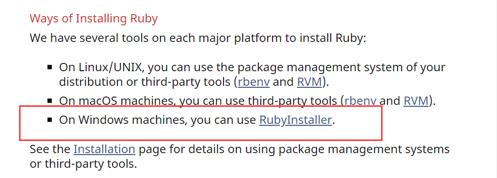
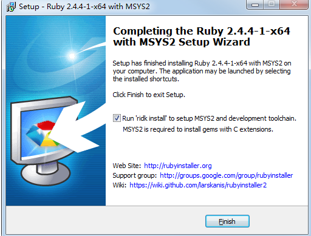

Jekyll 是一个简单免费的生成静态网页的工具，不需要数据库支持。GitHub Pages 也对jekyll提供了支持，使用jekyll对于初学者来说可以很不方便的在Github上部署自己的博客/简历等。

此处介绍一下jekyll的部署和使用，后续功能不定期更新。。。


# 1. 模板相关资源

---

- http://jekyllthemes.org/


# 2. 环境安装

---

jekyll依赖于Ruby，需要提前安装

下载并安装Ruby：http://www.ruby-lang.org/en/downloads/



我这边选择window版本的


直接下一步安装即可，最后一步记得勾选 **Run 'ridk install' to setup MSYS2**




点击Finish，跳到cmd命令窗口，输入3等待安装完毕


> 上面勾选了，一般安装完Ruby后都会带有Gem，没有的自己去下一个


检查安装：`ruby -v`、`gem -v`


==此处也可以先按照下面更改镜像源后再尝试==

安装jekyll：`gem install jekyll`

检查安装：`jekyll -v`


安装bundle：`gem install bundler`


# 3. 更改镜像源

---

**修改gem拉取源：**

将原本的国外镜像改为开源中国的镜像（淘宝的镜像已经没用了）


删除原有

```shell
gem sources --remove https://rubygems.org/
```

修改为新的

```shell
gem sources -a https://gems.ruby-china.com/
```

查看唯一的一个镜像源

```shell
gem sources -l
```


**修改bundle拉取源**

```shell
bundle config mirror.https://rubygems.org https://gems.ruby-china.com/
```


> 如果发现下载操作还是很慢，可以看看项目下的`Gemfile`文件，是否指定了国外的**source**，修改一下即可


# 4. 启动jekyll服务

---

**项目文件夹下**初始化依赖包：

这边初始化有点慢，建议耐心等待

```shell
bundle init
```

启用服务即可，然后就能愉快的玩耍了

```shell
jekyll s
```

正常的访问地址：http://localhost:4000（具体可以看cmd输出的提示）


# 5. 常见启动报错问题

---


依赖关系问题导致构建错误

```shell
bundle exec jekyll s
```


依赖包不存在

```shell
gem install 依赖包名称
```


---


最后展示下GitHub Pages下感人的网速


> kramdown + 自定义样式 功能少又丑。。。
>
> 有时间的再重新弄弄


