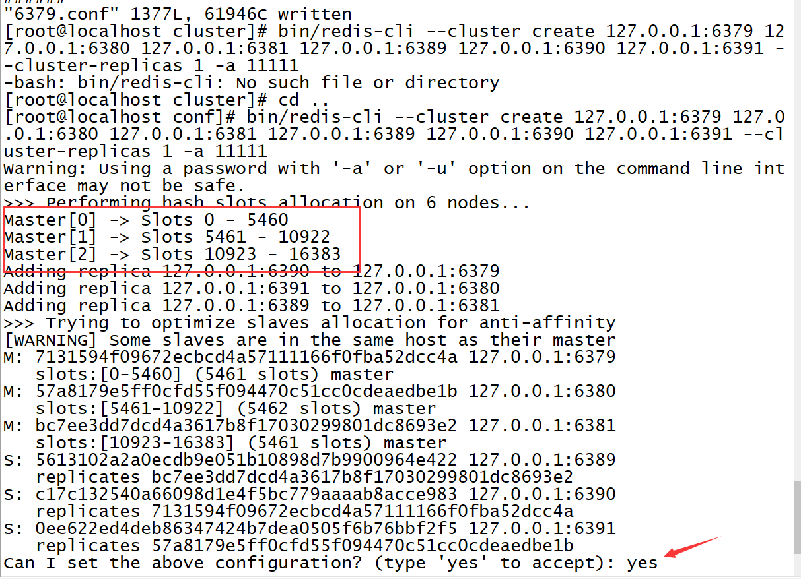

# Redis集群配置

---


集群依赖于Ruby

```
yum install ruby
yum install rubygems
```

> 章节1. 的操作可先不配置，看看


## 1. redis.gem环境安装

环境依赖ruby

官网下载源码包：http://www.ruby-lang.org/en/downloads/

```bash
# ruby-x.x.x/
./configure
make
make install

# 提示zlib缺少
yum install zlib-devel
cd ext/zlib/
ruby extconf.rb
make
make install

# 提示openssl缺少
yum install openssl-devel
cd ext/openssl
ruby extconf.rb
```


安装redis.gem

redis-xxx.gem下载：https://rubygems.org/downloads/redis-3.0.0.gem

```
gem install --local redis-xxx.gem
```


## 2. redis环境准备

redis集群，至少需要**六台**redis服务器，因为集群至少需要**三个主节点**

准备六个 **redis.conf** 配置文件

```bash
# 模板
# =====主从复制配置=====
port 6379 # 端口
daemonize yes # redis后台运行
pidfile /var/run/redis_6379.pid # pid文件名
logfile "6379.log" # 日志文件名
dbfilename dump6379.rdb # rdb备份文件名

# =========安全=========
requirepass password # 指定redis的密码
masterauth password # 指定master的密码

# =======集群配置=======
cluster-enabled yes # 开启集群模式
cluster-config-file nodes-6379.conf # 设置节点配置文件名（redis开启集群模式，启动后自动生成）
cluster-node-timeout 15000 # 设置节点超时时间（毫秒），超过后集群将自动进行主从切换
```


启动六次redis服务

```bash
bin/redis-server 6379.conf
bin/redis-server 6380.conf
bin/redis-server 6381.conf
bin/redis-server 6389.conf
bin/redis-server 6390.conf
bin/redis-server 6391.conf
```

查看服务是否都启动

```bash
ps -ef | grep redis
```


## 3. 合并集群

合并六个节点为一个集群


<font color="red">此处需要注意，合并指定的IP必须为实际IP，不能为127.0.0.1，否则java客户端操作 **JedisCluster** 时会连接失败！！！</font>


原本安装redis.gem时使用的命令

```bash
bin/redis-trib.rb create --replicas 1 127.0.0.1:6379 127.0.0.1:6380 127.0.0.1:6381 127.0.0.1:6389 127.0.0.1:6390 127.0.0.1:6391 -a password
```

现在的新的命令（只测试过gem安装后让我走这个命令）

> 没测试过不安装redis.gem是否该命令依然有效（应该是有效的）

```bash
bin/redis-cli --cluster create 127.0.0.1:6379 127.0.0.1:6380 127.0.0.1:6381 127.0.0.1:6389 127.0.0.1:6390 127.0.0.1:6391 --cluster-replicas 1 -a password
```


启动后，看到如下内容




上方的slot是插槽的意思，redis集群set key的时候，会根据某个算法算出该key对应的插槽，将值插入对应插槽的redis-master中


中间：

- M中可以看到 master节点的id，对应的主机和端口，分配的插槽范围

- S中可以看到 slave节点的id，对应的主机和端口，对应的master节点id


下方指定yes，设置该集群配置


## 4. 集群操作


以集群的方式进入客户端

```bash
bin/redis-cli -c -p 6379 -a password
```


测试集群客户端操作


可以看到上面set key时，根据key算出 slot 为 15495，而插槽在这个范围的是6381端口的master，就自动跳转到对应的master内

上面是由于配置了密码的缘故，需要连接的时候先认证一下，才能再设置值


集群关闭：

```bash
bin/redis-cli -p 6379 -a 11111 shutdown
bin/redis-cli -p 6380 -a 11111 shutdown
bin/redis-cli -p 6381 -a 11111 shutdown
bin/redis-cli -p 6389 -a 11111 shutdown
bin/redis-cli -p 6390 -a 11111 shutdown
bin/redis-cli -p 6391 -a 11111 shutdown

# 删除生成的所有相关的 .rdb nodes.conf 文件
```


## 5. 问题整理


集群中主节点操作时：<font color="red">(error) CLUSTERDOWN The cluster is down</font>

该节点可能在合并为集群时出现问题，需要重新合并集群环境（删除本地rdb、nodes环境，清空所有库中key）


