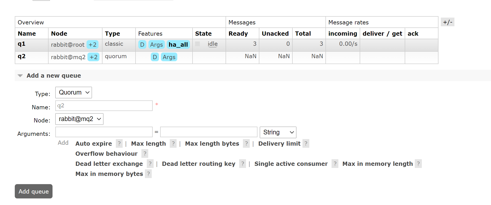

## 1. 普通集群

---

1、所有节点设置主机名

```shell
hostname xxx # 设置
hostname # 查看
```


2、配置ip地址与主机名的映射关系

编辑主机文件

```shell
vi /etc/hosts
```

添加所有节点的映射关系（包括自己），格式：`ip hostname`。


3、复制任意节点的`.erlang.cookie`文件到另外两台机器

```shell
# 跨服务器文件传输
# scp /path/file ip:/path/file
scp /var/lib/rabbitmq/.erlang.cookie <ip>:/var/lib/rabbitmq/.erlang.cookie
```


4、启动服务

```shell
systemctl start rabbitmq-server
```


5、从节点添加到主节点中

```shell
rabbitmqctl stop_app # 停止当前节点，保持Runtime(Erlang VM)运行
rabbitmqctl reset # 重置当前节点（会清空所有数据）
rabbitmqctl join_cluster rabbit@rabbit1 # 加入到指定节点，rabbit固定，rabbit1为主节点主机名
rabbitmqctl start_app # 启动当前节点，保持Runtime(Erlang VM)运行
```


6、查看集群状态

```shell
rabbitmqctl cluster_status
```


7、界面验证


8、取消加入集群

```shell
rabbitmqctl stop_app
rabbitmqctl reset
rabbitmqctl start_app
```


## 2. 镜像集群

---

建立在普通集群的基础上，只是队列改变为镜像队列了而已。

指定镜像策略：

```shell
rabbitmqctl set_policy ha_all \
"^q1" '{"ha-mode":"exactly","ha-params":2}' \
--apply-to queues
```


看到队列已经存在该镜像策略了


## 3. 仲裁集群

---

建立在普通集群的基础上，只是队列类型改变为quorum了而已。




## 4. 单机多实例集群

---


1、停止本地已有的RabbitMQ服务

```shell
systemctl stop rabbitmq-server
```

2、后台启动三台服务，端口不同

```shell
RABBITMQ_NODE_PORT=5672 RABBITMQ_SERVER_START_ARGS="-rabbitmq_management listener [{port,15672}]" RABBITMQ_NODENAME=rabbit-1 rabbitmq-server -detached
RABBITMQ_NODE_PORT=5673 RABBITMQ_SERVER_START_ARGS="-rabbitmq_management listener [{port,15673}]" RABBITMQ_NODENAME=rabbit-2 rabbitmq-server -detached
RABBITMQ_NODE_PORT=5674 RABBITMQ_SERVER_START_ARGS="-rabbitmq_management listener [{port,15674}]" RABBITMQ_NODENAME=rabbit-3 rabbitmq-server -detached
```


3、加入集群节点

> root为本地主机名

```shell
rabbitmqctl -n rabbit-2 stop_app
rabbitmqctl -n rabbit-2 join_cluster rabbit-1@root
rabbitmqctl -n rabbit-2 start_app

rabbitmqctl -n rabbit-3 stop_app
rabbitmqctl -n rabbit-3 join_cluster rabbit-1@root
rabbitmqctl -n rabbit-3 start_app
```

可以看到界面上的集群节点了


4、停止服务

```shell
rabbitmqctl stop -n rabbit-3@root
rabbitmqctl stop -n rabbit-2@root
```


