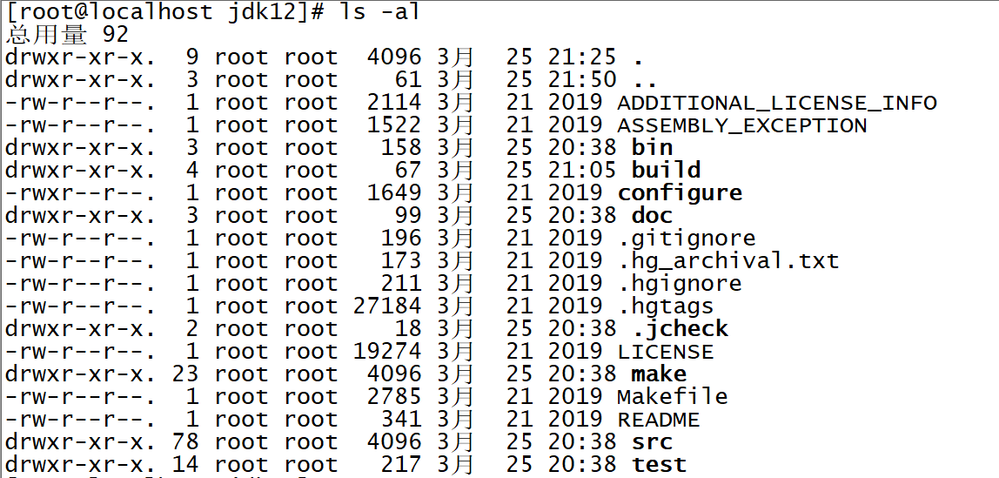

## 1. 环境

---

虚拟机 Centos7 4核8G

Clion2019.1


## 2. 下载

---

源码下载地址：https://hg.openjdk.java.net/jdk/jdk12

打开链接后，点击右侧browse，再点击右侧zip进行下载


> 或使用 Mercurial 拉取源码
>
> 下载地址：https://mercurial.selenic.com/release/windows/
>
> 拉取：`hg clone https://hg.openjdk.java.net/jdk/jdk12`


## 3. 编译

---

> 无论在什么平台下进行编译， 都建议认真阅读一遍源码中的**doc/building.html**文档

**1、解压缩源码包**

```bash
yum install -y zip
unzip <filename> -d <dirname>
```


**2、安装编译环境**

> 1、可以自行选择安装GCC或CLang来进行编译，但必须确保最低的版本为GCC 4.8或者CLang 3.2以上，官方推荐使用GCC 7.8或者CLang 9.1来完成编译
>
> 2、如果还有缺的环境，make编译的时候会有提示

```bash
yum install -y freetype freetype-devel
yum install -y cups
yum install -y xorg-x11-xauth
yum install -y *alsa*
yum install -y libffi libffi-devel
yum install -y autoconf
yum install -y libXtst-devel libXt-devel libXrender-devel libXrandr-devel libXi-devel
yum install -y cups-devel
yum install -y fontconfig-devel
yum groupinstall -y "Development Tools"
```


**3、安装Bootstrap JDK**（编译时也有java文件需要编译）

```bash
yum search java|grep jdk # 下载devel版本的（编译jdk12就需要jdk11+版本）
yum install -y java-11-openjdk-devel.x86_64
```


**4、进入源码根目录**

> 压缩包形式的可以使用 `unzip <filename> -d <dirname>` 解压




**5、测试配置**

> 通常我们编译OpenJDK的目的都不仅仅是为了得到在自己机器中诞生的编译成品， 而是带着调试、定制化等需求，这样就必须了解OpenJDK提供的编译参数才行，这些参数可以使用 **./configure --help** 命令查询

```bash
./configure --with-version-opt="baB.hyf" --with-version-pre=0 --with-version-build=88
```

常用参数描述：

- `--with-debug-level=<level>`：设置编译的级别，可选值为release、fastdebug、slowde-bug，越往后进行的优化措施就越少，带的调试信息就越多。还有一些虚拟机调试参数必须在特定模式下才可以使用。默认值为release。

- `--enable-debug`：等效于--with-debug-level=fastdebug。

- `--with-native-debug-symbols=<method>`：确定调试符号信息的编译方式，可选值为none、internal、external、zipped。

- `--with-version-string=<string>`：设置编译JDK的版本号， 譬如java -version的输出就会显示该信息。

这个参数还有`--with-version-<part>=<value>`的形式，其中part可以是pre、opt、build、major、minor、security、patch之一，用于设置版本号的某一个部分。

- `--with-jvm-variants=<variant>[， <variant>...]`：编译特定模式（Variants）的HotSpot虚拟机，可以多个模式并存，可选值为server、client、minimal、core、zero、custom。

- `--with-jvm-features=<feature>[， <feature>...]`：针对--with-jvm-variants=custom时的自定义虚拟机特性列表（Features），可以多个特性并存，由于可选值较多，请参见help命令输出。

- `--with-target-bits=<bits>`：指明要编译32位还是64位的Java虚拟机，在64位机器上也可以通过交叉编译生成32位的虚拟机。

- `--with-<lib>=<path>`：用于指明依赖包的具体路径，通常使用在安装了多个不同版本的Bootstrap JDK和依赖包的情况。其中lib的可选值包括boot-jd、freetype、cups、x、alsa、libffi、jtreg、libjpeg、giflib、libpng、lcms、zlib。

- `--with-extra-<flagtype>=<flags>`：用于设定C、C++和Java代码编译时的额外编译器参数，其中flagtype可选值为cflags、cxxflags、ldflags，分别代表C、C++和Java代码的参数。

- `--with-conf-name=<name>`：指定编译配置名称，OpenJDK支持使用不同的配置进行编译，默认会根据编译的操作系统、指令集架构、调试级别自动生成一个配置名称，譬如"linux-x86_64-serverrelease"，如果在这些信息都相同的情况下保存不同的编译参数配置，就需要使用这个参数来自定义配置名称。


**6、编译**

```bash
make images
```

> 遇到的报错查看：**jdk12/doc/building.html#troubleshooting**


**7、编译失败了需要清理临时文件**

```bash
make clean
make dist-clean
```


8、编译成功后会在 **jdk12/build/[name]/*** 下生成编译后的文件

测试：

```bash
./java -version
```


## 4. 导入IDE

---

CLion环境配置：https://blog.csdn.net/qq_41649001/article/details/107301079

下载MinGW版本：16.1

IDE导入：

New CMake Project from Sources...，选择jdk12，下一步会自动选择导入的模块，完成即可，会自动生成CMakeLists.txt

Edit Configurations...，创建一个CMake Application，Executable选择编译后的java文件，Program arguments输入：`-version -XX:+TraceBytecodes -XX:StopInterpreterAt=395`（395为jvm的入口断点位置），Before Launch下的build删除，调试时防止编译。


Debug即可。


