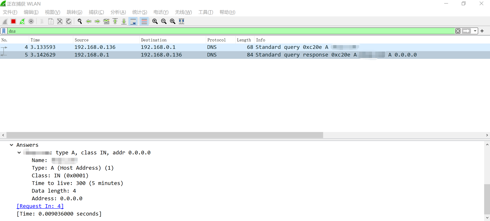
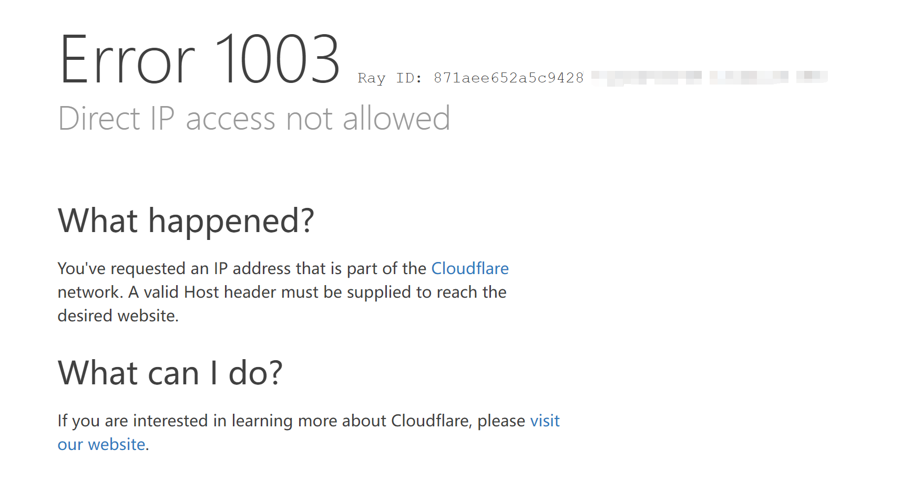
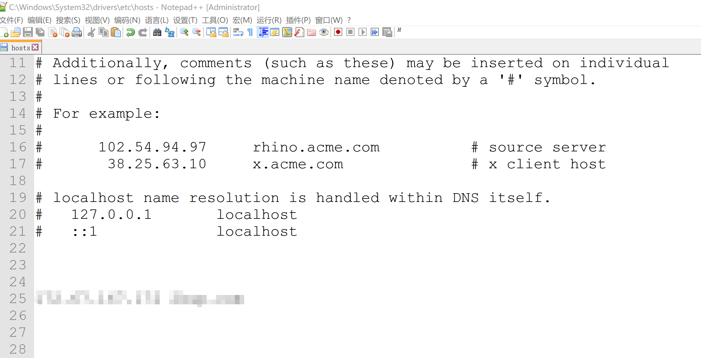
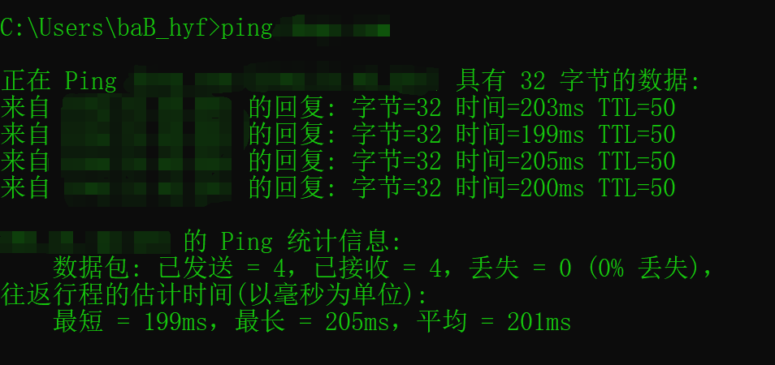

# 20240409

背景：

之前做过一个爬取网站视频资源的程序，用了几个月了好好的，节假日回家后闲着没事儿电脑打开放在那儿爬，因为我上海那边的网络慢得很，每天爬不了多少，结果爬虫放在那1分钟给爬了3个多G的数据，感到震惊（其实并不意外，自己写的程序性能都是狠狠优化过的），爬的量有点大，过了一段时间就关掉了，第二天再次爬的时候发现程序时不时的报错了。

一开始怀疑是网站那边有问题，不稳定，就等了几天，结果发现之后程序就一直报错，连好的情况都不存在了，感觉有点不对劲，后来浏览器访问网站，发现直接就打不开了。

那可不行啊，得赶紧看看什么情况，我浏览网址不怎么感兴趣，攻击网址可是喜欢的很哇，爬虫爬什么数据不重要，重要的是要征服爬取的网站哇

排查：

浏览器访问，看到下面这个，一开始有点疑惑，然后就嘴角微微上扬

浏览器错误码 `ERR_ADDRESS_INVALID`，很明显应该就是这网站的管理员搞的，可能是那天下载的量太大，管理员看到系统后台监控页面有个流量突刺，把我给加到黑名单里了，如果搞了防火墙啥的把我IP给封了，那我就没什么办法了，但看到这个问题，心里就有底了，好解决

众所周知，用户输入URL访问网站，浏览器会先进行一次DNS解析，将域名转换为IP地址，再通过IP地址访问服务器获取资源，错误码很明显是转IP这个过程出问题导致的。再联想到之前可以，现在不可以，那应该是在DNS那做了什么手脚，关于DNS的问题出了名的就那么几种，首先考虑到DNS污染，打开wireshark测试一下

看到了有意思的东西，DNS返回给我了 `0.0.0.0` 地址，没错了就是这问题。诶，这网址管理员竟然这么对待自己的用户，太令我失望了

总结一下，浏览器发送DNS报文查询域名，从根域名一路向下查询到网站自己的本地域名服务器，本地域名服务器正常会返回网站域名对应的IP地址给用户，但我被加到黑名单里了，此时收到报文，发现是我这个IP发过去的，就返回了错误的 `0.0.0.0` 地址，导致我通过这个地址无法找到网址服务器了

解决方案：

我心想，最简单的方案就是不用域名，直接通过IP，绕过DNS查询，先换台电脑，获取下正常的IP地址，通过IP访问，结果。。。

网站服务器不支持IP访问，应该是发送的HTTP报文里的Host头是IP，解析拦截了，虽然可以通过代理搞定，不过太麻烦了

没办法，换成第二个方案，更暴力一点，直接修改Hosts文件

众所周知，DNS解析会先进行本地配置文件查询，没有再通过根域名服务器获取，改了这里，就不进行DNS查询，直接返回本地配置死的了

改完以后，爬虫没问题了，浏览器也正常访问了，完美~~~

收尾：

修改爬虫程序，通过开关配置，在网络良好的环境下降低程序性能，不进行暴力爬取了，避免再被关到其他的小黑屋，毕竟细水长流

